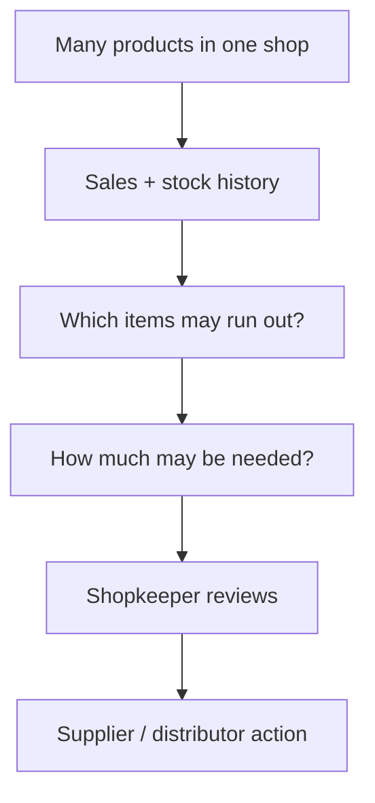
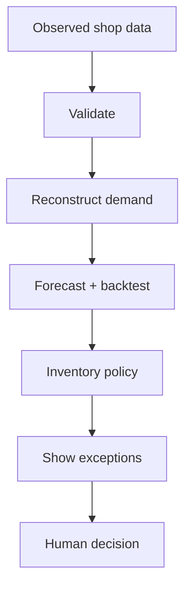

# KiranaFlow Replenishment Pilot

**A supply-chain decision-support prototype for independent kirana shops and their replenishment network.**

The project asks one practical question:

> A shop has hundreds of products. Which products need attention today, how much may need to be reordered, and what evidence supports that suggestion?

This is not a billing/POS replacement. It is the **analytics and replenishment** project.

## The problem in one picture



A human stays in the loop. A recommendation is not silently turned into a purchase order.

## Who is it for?

### Shopkeeper

It is meant to reduce the work of manually checking every product. The pilot can import a reviewed multi-product CSV, analyse usable product histories and show which SKUs deserve attention.

### Distributor

The engineering core can aggregate shop requirements and test constrained allocation when supply is scarce. The current distributor data is synthetic: there is **no live distributor connection yet**.

### Supply-chain / industrial engineering reviewer

The source exposes the reasoning rather than hiding it behind a dashboard: data validation → demand reconstruction → forecast selection → inventory policy → exception handling → human decision → network allocation.

## How it works



The important rule is simple: **bad evidence should not create a confident recommendation.** Missing is not silently treated as zero, a stockout is not automatically treated as zero demand, and stale/conflicted/insufficient states can suppress advice.

## Real-shop Field Pilot path

The current field mode supports:

- shop setup;
- reviewed multi-product CSV import;
- schema and row validation before commit;
- local persistent catalogue;
- per-SKU forecasting and inventory-policy analysis;
- products-needing-attention view;
- local JSON backup and restore.

The required CSV columns are:

`date, sku, product, quantity_sold, closing_stock, unit, lead_time_days, pack_size`

`supplier` is optional.

Invalid rows are shown for correction instead of being silently converted into operational facts.

## What is not yet live

- direct POS integration;
- automatic handwriting OCR;
- complete daily receipt/count entry for the imported real-shop catalogue;
- production authentication;
- automatic cloud backup;
- live shop ↔ distributor synchronization;
- automated purchase-order execution;
- field-validated forecasting benefit.

Those are development or field-validation gates. They are not represented as finished features.

## Try it

For a no-server demonstration, open `kiranaflow-standalone.html`.

For development:

```bash
npm test
npm run build
npm start
```

No external npm dependency is required by the current build.

## Guides for normal users

- [Shopkeeper use manual](docs/SHOPKEEPER-MANUAL.md)
- [Distributor pilot guide](docs/DISTRIBUTOR-MANUAL.md)
- [Questions to ask before a real pilot](docs/PILOT-QUESTIONS.md)
- [Technical architecture in plain language](docs/ARCHITECTURE.md)
- [Engineering gates and test details](ENGINEERING.md)

## Test evidence versus field evidence

The automated suite currently passes **78 tests**, including seeded invariant/property checks over synthetic inventory and constrained-allocation states. These tests show that specified software rules hold for the tested cases.

They do **not** prove that the project reduces stockouts, improves profit or increases forecast accuracy in real shops. Such claims require a real field study with real observations and agreed outcome measures.

