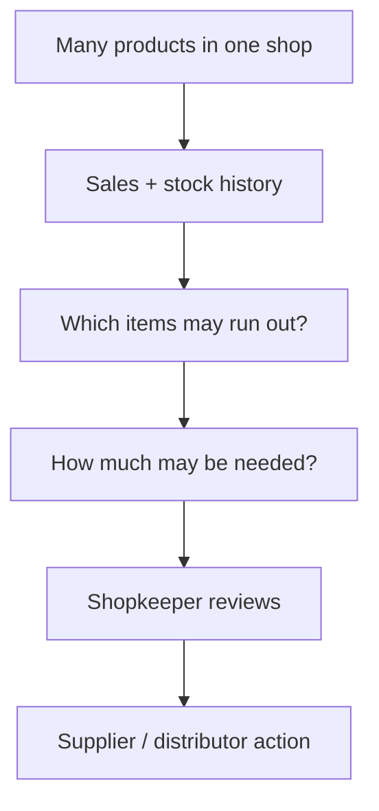
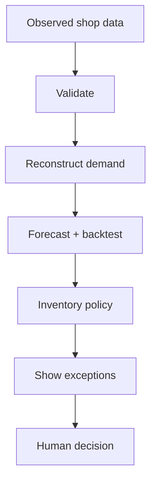
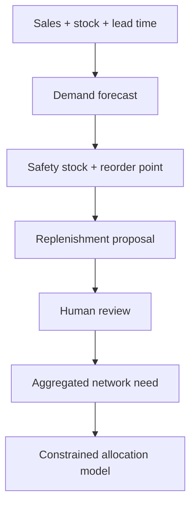

# KiranaFlow Replenishment Pilot

**A supply-chain analytics and replenishment decision-support prototype for independent kirana shops, combining demand forecasting, inventory control, exception management and constrained network allocation.**

The project asks one practical question:

> A shop has hundreds of products. Which products need attention today, how much may need to be reordered, and what evidence supports that suggestion?

This is not a billing/POS replacement. It is the **analytics and replenishment** project.

## The problem in one picture



A human stays in the loop. A recommendation is not silently turned into a purchase order.

## Who is it for?

### Shopkeeper

It is meant to reduce the work of manually checking every product. The pilot can import a reviewed multi-product CSV, analyse usable product histories and show which SKUs deserve attention.

### Distributor

The engineering core can aggregate shop requirements and test constrained allocation when supply is scarce. The current distributor data is synthetic: there is **no live distributor connection yet**.

### Supply-chain / industrial engineering reviewer

The source exposes the reasoning rather than hiding it behind a dashboard: data validation → demand reconstruction → forecast selection → inventory policy → exception handling → human decision → network allocation.

## How it works



The important rule is simple: **bad evidence should not create a confident recommendation.** Missing is not silently treated as zero, a stockout is not automatically treated as zero demand, and stale/conflicted/insufficient states can suppress advice.

## Supply-chain concepts inside the project

The project is deliberately built around recognised operations and supply-chain analytics concepts, but only claims a concept where the current code actually implements or explicitly models it.

| Concept | What it means here | Why it is useful |
|---|---|---|
| **Demand forecasting** | Candidate forecasting methods are compared using rolling backtests on usable sales history. | Gives replenishment decisions an estimate of future demand instead of relying only on today's shelf quantity. |
| **Demand sensing under stockouts** | A zero sale while an item was unavailable is kept distinct from observed zero demand. | Avoids teaching the forecast that customers wanted nothing simply because the shelf was empty. |
| **Inventory control** | Current/incoming stock, forecast demand, lead time and review period feed the inventory policy. | Connects demand information to an operational stock decision. |
| **Safety stock** | A buffer is calculated from demand variability, lead-time variability and an explicit service factor. | Provides protection against uncertainty rather than ordering only for average demand. |
| **Reorder point & target stock** | The engine calculates reorder point, target stock, days of cover and a proposed requirement. | Helps answer both *when should this SKU receive attention?* and *how much may be needed?* |
| **Lead-time management** | Supplier lead time is an explicit policy input and deteriorating lead time can create an exception. | A product with adequate stock today can still be risky when replenishment takes longer. |
| **Exception management** | Stock risk, insufficient history, stale/conflicted evidence and other conditions can be surfaced or can suppress advice. | Directs scarce human attention toward items that need review instead of asking the shopkeeper to inspect every SKU. |
| **Decision support with human control** | Recommendations remain proposed decisions; a person can accept, modify, defer or reject them. | Keeps analytics advisory when information is incomplete and prevents an estimate from silently becoming an order. |
| **Multi-echelon / network coordination (modelled)** | Shop requirements can be aggregated at network level. | Shows how retailer demand information could support distributor planning once a real integration exists. |
| **Constrained allocation (modelled)** | When distributor stock is scarce, the optimiser allocates within available stock, shop need and pack-size constraints using an explicit priority policy. | Makes shortage allocation auditable and prevents the model from allocating inventory that does not exist. |

### From data to a supply-chain decision



This creates a small but coherent **data → prediction → inventory policy → decision → network** chain. It also exposes the trade-off at the centre of inventory planning: too little stock can reduce product availability, while too much stock ties up working capital and shelf/storage capacity.

These concepts align with current operations and supply-chain analytics practice: forecasting and inventory management, analytical decision models, optimisation, uncertainty, material/information flows, supplier coordination, performance measurement and resilience. The project does **not** claim to implement every part of that wider field; for example, it does not currently implement transport routing, production scheduling or a live procurement network.

## Real-shop Field Pilot path

The current field mode supports:

- shop setup;
- reviewed multi-product CSV import;
- schema and row validation before commit;
- local persistent catalogue;
- per-SKU forecasting and inventory-policy analysis;
- products-needing-attention view;
- local JSON backup and restore.

The required CSV columns are:

`date, sku, product, quantity_sold, closing_stock, unit, lead_time_days, pack_size`

`supplier` is optional.

Invalid rows are shown for correction instead of being silently converted into operational facts.

## What is not yet live

- direct POS integration;
- automatic handwriting OCR;
- complete daily receipt/count entry for the imported real-shop catalogue;
- production authentication;
- automatic cloud backup;
- live shop ↔ distributor synchronization;
- automated purchase-order execution;
- field-validated forecasting benefit.

Those are development or field-validation gates. They are not represented as finished features.

## Try it

For a no-server demonstration, open `kiranaflow-standalone.html`.

For development:

```bash
npm test
npm run build
npm start
```

No external npm dependency is required by the current build.

## Guides for normal users

- [Shopkeeper use manual](docs/SHOPKEEPER-MANUAL.md)
- [Distributor pilot guide](docs/DISTRIBUTOR-MANUAL.md)
- [Questions to ask before a real pilot](docs/PILOT-QUESTIONS.md)
- [Technical architecture in plain language](docs/ARCHITECTURE.md)
- [Engineering gates and test details](ENGINEERING.md)

## Test evidence versus field evidence

The automated suite currently passes **78 tests**, including seeded invariant/property checks over synthetic inventory and constrained-allocation states. These tests show that specified software rules hold for the tested cases.

They do **not** prove that the project reduces stockouts, improves profit or increases forecast accuracy in real shops. Such claims require a real field study with real observations and agreed outcome measures.
