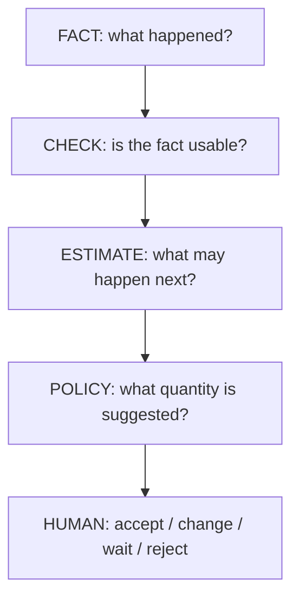

# Architecture in plain language

## One idea controls the whole design

**Facts come first. Calculation comes second. Human action comes last.**

## Why this matters

If a product sold zero today, customers may not have wanted it, or customers may have wanted it while the shelf was empty. Those are not the same supply-chain fact. The engine therefore keeps stockout-censored demand distinct from an observed zero.

## Main engine blocks

### 1. Validation
Checks identity, quantity, time, unit and contradictory states. Missing required quantities do not silently become zero.

### 2. Demand reconstruction
Builds demand history while keeping stockout/missing evidence visible.

### 3. Forecasting
Compares supported candidate methods with rolling backtests. Insufficient history returns an explicit insufficient state.

### 4. Inventory policy
Uses forecast, variability, lead time, review period, current/incoming stock and pack size to create a **proposed** replenishment requirement.

### 5. Exception layer
Surfaces important conditions and suppresses recommendations when evidence is invalid, stale, conflicted or insufficient.

### 6. Human decision
The user can accept, modify, defer or reject. A recommendation fingerprint makes changed state detectable. Acceptance does not execute an order.

### 7. Network layer
Combines one net requirement per shop and can model allocation when distributor supply is scarce. Unknown distributor availability stays unknown; it is not converted to zero.

## Current boundary

The deterministic analytical core is implemented and tested. External adapters for a real POS, handwriting OCR, hosted authentication/cloud data and live distributor systems are not yet operational.

