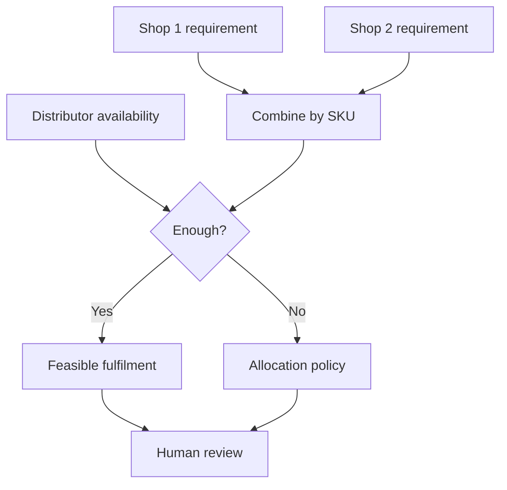

# Distributor pilot guide

## Why could a distributor care?

One shop says, “I need 20.” Another says, “I need 40.” The distributor may have only 30.

The project contains a tested network layer for combining requirements and modelling constrained allocation under an explicit priority policy.

## What does “tested” mean here?

Software tests check rules such as stock conservation, shop bounds and pack feasibility in the tested synthetic cases. It does **not** mean a distributor is live on the system today.

## Before connecting a real distributor, ask

1. Where is current stock recorded: ERP, accounting software, spreadsheet or paper?
2. Can it export SKU and available quantity?
3. How often is that quantity updated?
4. Do shops use the same SKU code as the distributor?
5. Is the selling unit piece, pack or case?
6. How do shops send orders today?
7. When supply is short, what allocation rule is actually used?
8. Who approves the final quantity?
9. How is dispatch confirmed?
10. How is receipt at the shop confirmed?
11. Which shop data must never be visible to another shop?

Until those questions are answered and an authenticated connection exists, the system must not say “live distributor stock” or “confirmed order.”

## Possible benefit to test

A real pilot could test whether earlier, cleaner retailer requirement data helps a distributor plan allocation and reduces manual re-entry. No improvement percentage is claimed because we do not yet have field evidence.

