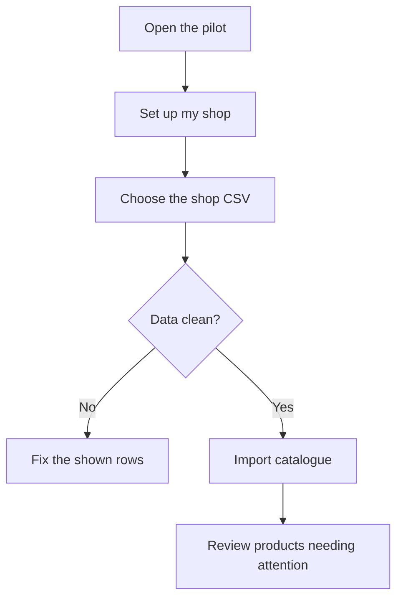

# Shopkeeper manual — very simple version

## Why would I use this?

Imagine your shop has 600 items. You already know your shop. But you cannot stare at all 600 items all day.

KiranaFlow Replenishment Pilot tries to answer:

> **“Which items should I check first, and how much may I need to order?”**

It does not replace your judgment. It prepares a shorter list for you to review.

## What information does it need?

For each product, the pilot needs trustworthy history such as date, SKU, product name, quantity sold, closing stock, unit, supplier lead time and pack size.

It cannot know shelf stock by magic. The number must come from a real record, count or later integration.

## First-time setup

1. Open `kiranaflow-standalone.html` in Chrome or Edge.
2. Click **Set up my shop**.
3. Write the shop name.
4. Download the CSV template if you need it.
5. Choose the CSV containing your product history.
6. Let the program check the rows.
7. If it shows an error, fix that row in the source data.
8. Import only when the review says the data is ready.

## What happens after import?

For products with enough usable information, the program estimates demand, combines it with stock, lead time and pack size, and shows replenishment information.

**Past demand + stock today + waiting time for new stock → item may need attention.**

The full algorithm is more careful than that sentence, but that is the basic idea.

## What should I do with a suggestion?

Ask:

1. Is the stock number correct?
2. Were recent sales entered?
3. Was the item unavailable while customers were asking for it?
4. Is the supplier taking longer than usual?
5. Is something unusual coming: festival, school opening, rain, local event or promotion?

If the computer and your shop knowledge disagree, record the disagreement during a field pilot. That tells us something important about the model or its data.

## Where is my information stored?

The current field pilot stores its working catalogue on that browser/device using browser storage. It can create a JSON backup that you download yourself.

It is **not automatic cloud backup**. Clearing browser data without a usable backup can lose local pilot data.

## What benefit are we testing?

We are testing whether the system can help the shopkeeper notice stock risk earlier, spend less time checking every SKU manually, make replenishment quantities more systematic and preserve the reason for accepting or changing a suggestion.

These are pilot hypotheses. The project does not claim they have already been proven in real shops.

